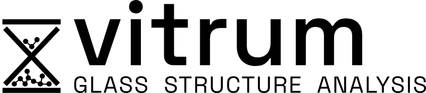

<p align="center">
  <picture>
    <source media="(prefers-color-scheme: dark)" srcset="docs/vitrum_light.png">
    <source media="(prefers-color-scheme: light)" srcset="docs/vitrum.png">
    
  </picture>
</p>

<p align="center">
  <a href="https://vitrum.readthedocs.io/en/latest/?badge=latest"></a>
  <a href="https://pypi.org/project/vitrum/"></a>
  <a href="https://pypi.org/project/vitrum/"></a>
</p>

**vitrum** is a Python package designed for the generation, analysis, and simulation of disordered and glassy atomic structures. It provides a comprehensive suite of tools for structural characterization, diffusion analysis, and tools for machine learning-driven potential development.

## 🚧 Active development
vitrum is under active development. As of 1.0, the public API follows [semantic versioning](https://semver.org/) — breaking changes will be reflected in a major version bump and noted in the [changelog](CHANGELOG.md).

## 📖 Documentation
Please see the `docs` folder for detailed documentation or check the [online documentation](https://vitrum.readthedocs.io/en/latest/).

## 📦 Installation

`vitrum` is available on [PyPI](https://pypi.org/project/vitrum/):

```bash
pip install vitrum
```

To install dependencies for simulation workflows (atomate2, fireworks, jobflow):

```bash
pip install vitrum[workflows]
```

For the latest development version, clone the repository and install it in editable mode instead:

```bash
git clone https://github.com/R-Chr/vitrum.git
cd vitrum
pip install -e .
```

## 🚀 Examples
See the [`examples`](examples/) folder for runnable Jupyter notebooks demonstrating scattering/RDF analysis, Qn speciation, and random structure generation, among others.

## 🎯 Scope and Functionality

`vitrum` offers:

### 1. Structural Characterization
*   **Scattering Functions**: Calculate partial and total Radial Distribution Functions (RDF) and Structure Factors ($S(q)$) for both Neutron and X-ray scattering (`vitrum.scattering`).
*   **Ring Analysis**: Analyze ring size distributions and statistics in network glasses (`vitrum.rings`).
*   **Void/Cavity Analysis**: Quantify free volume fraction and discrete cavity size distributions via a grid/probe-accessible-volume method (`vitrum.voids`).
*   **Topological Analysis**: Compute persistent homology to identify medium-range order and topological features (`vitrum.persistent_homology`).
*   **Coordination & Angles**: Analyze bond angle distributions and coordination environments (`vitrum.coordination`).

### 2. Dynamics & Diffusion
*   **Diffusion Analysis**: Calculate Mean Squared Displacement (MSD), diffusion coefficients, and Van Hove correlation functions (`vitrum.diffusion`).


## 📑 Citation
If you use `vitrum` in your work, please cite it. Each GitHub release is archived on Zenodo with a version-specific DOI; see [`CITATION.cff`](CITATION.cff) for the citation metadata (GitHub's "Cite this repository" button uses this file automatically).

[](https://doi.org/10.5281/zenodo.21366368)


## 🤝 Contributing
Bug reports, test cases and pull requests are welcome. See [CONTRIBUTING.md](CONTRIBUTING.md)
for the development setup and what a mergeable change looks like, and
[CODE_OF_CONDUCT.md](CODE_OF_CONDUCT.md) for community expectations. Security issues should
go through [SECURITY.md](SECURITY.md) rather than the public issue tracker.

## 👥 Author
Rasmus Christensen (rasmus.christensen.a1@tohoku.ac.jp)

## ⭐ Acknowledgements
`vitrum` relies on several powerful open-source packages:
*   [ASE](https://wiki.fysik.dtu.dk/ase/)
*   [Pymatgen](https://pymatgen.org/)
*   [NumPy](https://numpy.org/) / [SciPy](https://scipy.org/) / [pandas](https://pandas.pydata.org/)
*   [scikit-learn](https://scikit-learn.org/)
*   [Dionysus](https://mrzv.org/software/dionysus2/) / [DioDe](https://github.com/mrzv/diode)
*   [Atomate2](https://github.com/materialsproject/atomate2) / [Jobflow](https://materialsproject.github.io/jobflow/) / [Fireworks](https://materialsproject.github.io/fireworks/)