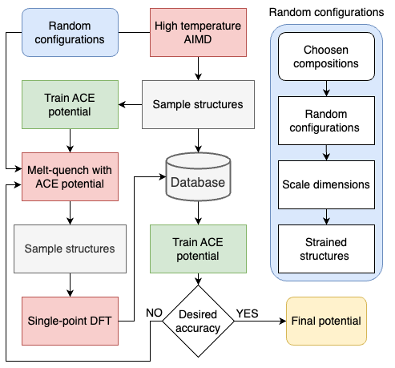

# Batch active learning ACE (BALACE) 

Automated framework for parameterizing interatomic potential using ACE for disordered material systems.

## Overview:


# Requirements:

## LAMMPS
A Lammps installation with the ML-PACE package. See (https://docs.lammps.org/Build_extras.html#ml-pace) for futher instructions.

## VASP
A VASP installation is needed to run AIMD and single-point calculations. In our development we used version 6.4.3, but other version should be compatible. The VASP installation should be setup to work with Fireworks.

## Fireworks
A  FireWorks launchpad attached to a MongoDB is needed for the framework to manage various jobs that will run. Large scale storage in the MongoDB is not currently necessary as the framework uses local files on the system to extract structures from OUTCARS and dumpfiles for building the training data sets etc. A free MongoDB Atlas database can be used as described here (https://www.mongodb.com/products/platform/atlas-database)

## Pacemaker
To use the framework pacemaker is needed to parameterize ACE potentials, which needs to be installed in the the following way:

### Installation of tensorpotential
tensorpotential allows for the GPU accelerated optimization of the ACE potential using TensorFlow. However, it is recommended to use it even if you don't have a GPU available.

Install it using the following commands:

Install Tensorflow (newer version should be also compatible)
```
pip install tensorflow==2.8.0
```

Download the tensorpotential from this repository.
Clone with
```
git clone https://github.com/ICAMS/TensorPotential.git
cd TensorPotential
```

Run installation script
```
pip install --upgrade .
```

### Installation of pacemaker and pyace
The python-ace package with its pacemaker framework is also needed. It contains the pacemaker tools and other Python wrappers and utilities.

To install pyace:

Download pyace
```
git clone https://github.com/ICAMS/python-ace.git
```

Run installation script
```
pip install --upgrade .
```